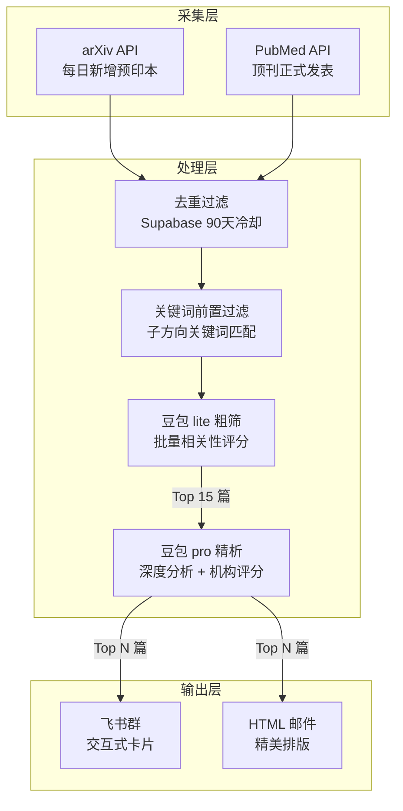
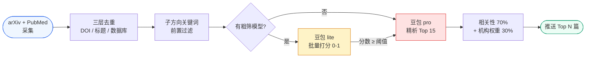
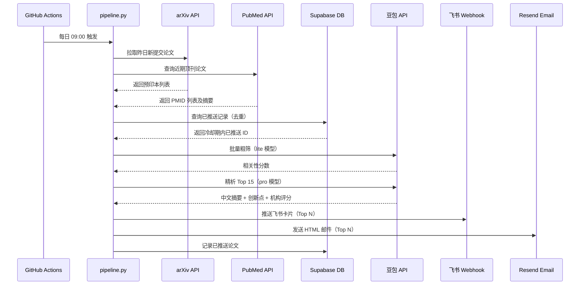

# 📄 PaperBot — 每日学术论文智能推荐系统

<div align="center">


**从每天数百篇预印本中，自动筛选出最值得读的论文，推送到邮件和飞书群。**

完全支持自定义论文主题，例如每日 AI 方向 · 每周计算光学方向 · 完全免费部署 · 月均费用 ¥7


</div>

---

## ✨ 核心特性

- 🔍 **多源采集** — arXiv（每日新增）+ PubMed（顶刊）双渠道，覆盖预印本与正刊
- 🤖 **双模型 AI 筛选** — 豆包 lite 粗筛降本，豆包 pro 精析提质，生成中文摘要
- 🏛️ **机构权重评分** — MIT / Stanford / OpenAI / DeepMind 等顶级机构额外加分
- 🏆 **顶会标签提取** — 自动识别 "Accepted at CVPR 2024" 等接收信息并高亮显示
- 📬 **双渠道推送** — 飞书群卡片 + HTML 邮件，格式精美
- 🗂️ **完全自定义主题** — 修改 `config.yaml` 或命令行工具，随时增删研究方向
- ♻️ **智能去重** — Supabase 记录推送历史，90 天内不重复推荐同一篇论文
- ⚙️ **零运维** — GitHub Actions 全自动定时运行，无需服务器

---

## 🗺️ 系统架构



---

## 🔄 筛选流水线



---

## 📦 项目结构

```
paper-rec/
├── pipeline.py          # 主程序：采集 → 筛选 → 分析 → 推送
├── config.yaml          # 所有配置：主题 / 关键词 / 机构列表 / 推送设置
├── manage_topics.py     # 命令行主题管理工具
├── test_fetch.py        # 论文采集独立测试脚本
├── test_local.py        # 全链路本地测试脚本
├── requirements.txt     # Python 依赖
├── setup_database.sql   # Supabase 建表 SQL（一次性执行）
└── .github/
    └── workflows/
        └── daily.yml    # GitHub Actions 定时任务配置
```

---

## 🎯 示例主题

### AI 综合（每日推送）

| 子方向 | 关键词示例 |
|--------|-----------|
| 图像增强与复原 | super-resolution · denoising · image restoration |
| 图像生成 / 扩散模型 | diffusion model · DDPM · text-to-image · DiT |
| 大语言模型 | LLM · instruction tuning · RLHF · chain of thought |
| 多模态 | VLM · CLIP · vision-language · MLLMs |
| AI Agent | autonomous agent · tool use · planning · embodied AI |
| 强化学习 | RL · PPO · reward model · policy gradient |

### 生物光学与计算成像（每周推送）

| 子方向 | 关键词示例 |
|--------|-----------|
| 荧光显微成像 | STED · PALM · STORM · TIRF · confocal |
| 自适应光学 | adaptive optics · wavefront correction · deformable mirror |
| 超分辨显微 | structured illumination · expansion microscopy · MINFLUX |
| 光片显微镜 | light sheet · SPIM · lattice light sheet |
| 计算成像 | phase retrieval · ptychography · lensless · digital holography |
| 物理启发深度学习 | physics-informed neural · inverse problem · image reconstruction |

---

## 💬 推送效果预览

### 飞书群卡片

```
📄 今日AI综合论文 · 2024-03-05

共 10 篇 · AI 自动筛选分析

━━━━━━━━━━━━━━━━━━━━━━━━━━━━━━
1. FlowEdit: Inversion-Free Training-Free ...   ✨ ICLR 2025
   *Asaf Shul, Eran Kotler, Daniel Cohen-Or 等*  `arXiv` · cs.CV

   💡 创新点：无需反转的扩散模型文本引导图像编辑方法

   📝 提出基于流匹配的图像编辑框架，通过...（中文摘要）

   ⭐ 推荐理由：解决扩散模型编辑的核心痛点，来自 Tel Aviv University
━━━━━━━━━━━━━━━━━━━━━━━━━━━━━━
```

### HTML 邮件

每篇论文独立卡片，包含：编号标题 · 作者机构 · 来源标签 · 顶会徽章 · 中文摘要 · 推荐理由 · 查看原文按钮

---

## 🚀 快速部署

### 1. 所需账号（除AI模型API外，全部免费）

| 服务 | 用途 | 申请地址 |
|------|------|---------|
| 火山方舟 | Doubao AI 分析 | [console.volcengine.com/ark](https://console.volcengine.com/ark) |
| Supabase | 论文去重数据库 | [supabase.com](https://supabase.com) |
| Resend | 邮件推送 | [resend.com](https://resend.com) |
| 飞书自定义机器人 | 群消息推送 | 飞书群设置 → 机器人 |
| NCBI（可选） | PubMed 速率提升 | [ncbi.nlm.nih.gov/account](https://www.ncbi.nlm.nih.gov/account/) |

### 2. 三步完成部署

```bash
# 克隆仓库
git clone https://github.com/你的用户名/paper-rec.git
cd paper-rec

# 修改配置（只需改邮箱地址）
vim config.yaml

# 推送
git add . && git commit -m "初始化" && git push
```

### 3. 配置 GitHub Secrets

在仓库 Settings → Secrets and variables → Actions 中添加：

| Secret 名称 | 说明 |
|-------------|------|
| `ARK_API_KEY` | 火山方舟 API Key |
| `SUPABASE_URL` | Supabase 项目 URL |
| `SUPABASE_KEY` | Supabase anon public key |
| `RESEND_API_KEY` | Resend API Key |
| `FEISHU_WEBHOOK` | 飞书机器人 Webhook 地址 |

### 4. 手动触发测试

GitHub 仓库 → Actions → PaperBot 每日论文推荐 → Run workflow

> 首次建议勾选 `dry_run = true`，不实际推送，只生成预览文件

---

## ⚙️ 自定义主题

### 方式一：修改 config.yaml（推荐）

```yaml
topics:
  - id: my_topic
    name: "强化学习"
    enabled: true
    schedule: daily     # daily 或 weekly
    top_n: 8            # 最终推送篇数
    sources:
      arxiv:
        enabled: true
        categories: [cs.LG, cs.AI, cs.RO]
        max_results: 50
    keywords:
      - "reinforcement learning"
      - "PPO"
      - "reward model"
    coarse_model: "doubao-lite-4k-xxxxxx"
    deep_model: "doubao-pro-32k-xxxxxx"
    context: "强化学习、策略优化、RLHF"
```

### 方式二：命令行工具

```bash
python manage_topics.py list              # 查看所有主题
python manage_topics.py add               # 交互式添加
python manage_topics.py disable bio_optics  # 禁用某主题
python manage_topics.py delete  bio_optics  # 删除某主题
```

---

## 💰 费用估算

| 项目 | 费用 | 说明 |
|------|------|------|
| 火山方舟 Doubao | ~¥7 / 月 | 粗筛用 lite，精析用 pro |
| Supabase | 免费 | 500MB 足够用数年 |
| Resend | 免费 | 每天 100 封，完全够用 |
| GitHub Actions | 免费 | 公共仓库无限分钟 |
| **合计** | **~¥7 / 月** | |

---

## 🔧 本地测试

```bash
pip install -r requirements.txt

# 测试论文采集（不需要 AI Key）
python test_fetch.py --only arxiv
python test_fetch.py --only pubmed --days 60

# 测试完整流水线（需要所有 Key）
export ARK_API_KEY="your_key"
python pipeline.py --topic ai_general --dry-run
```

---

## 📋 数据流说明



---

## 📄 License

MIT License · 欢迎 Fork 和 Star ⭐
